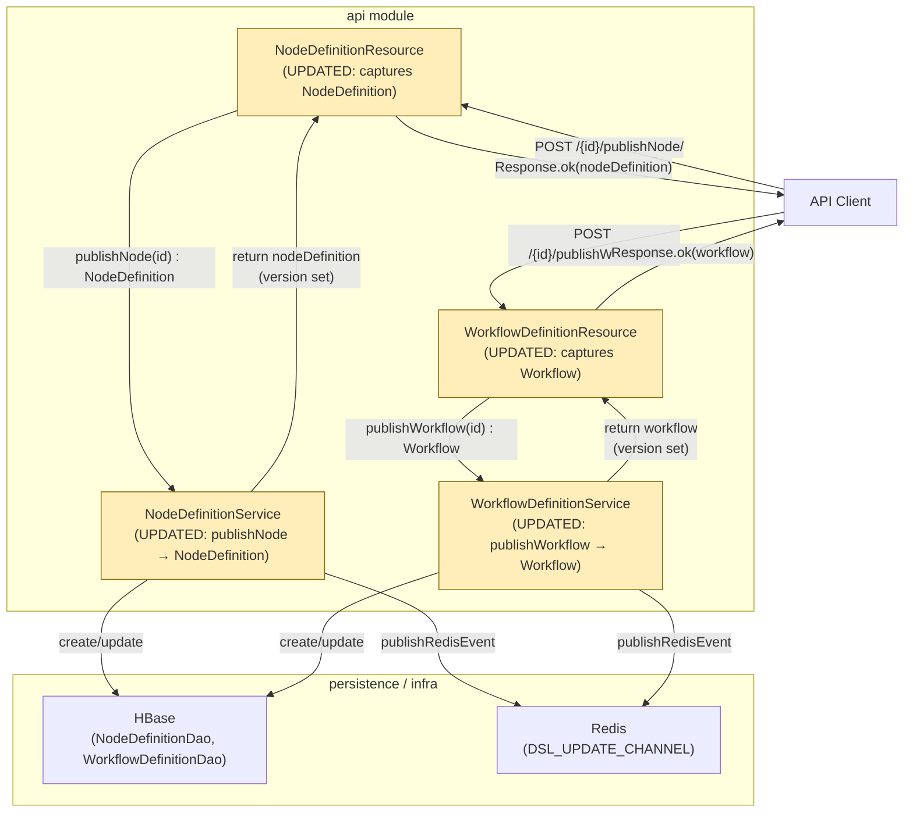

# High-Level Design: Propagate Entity Version on Publish

**Feature tag:** `publish-version-fix`
**Date:** 2026-06-12
**Status:** Active
**Affected modules:** `api`
**Risk level:** Very Low — 4 files, ~8 lines, pure return-type wiring, no logic change
**Expanded PRD:** `harness-docs/design/active/publish-version-fix-prd-expanded.md`

---

## Section 1: Executive Summary

### Scope

Two service methods (`publishNode`, `publishWorkflow`) compute the new version and set it on the entity before persisting, but return `void`. The two resource handlers consequently build empty HTTP 200 responses. The fix threads the already-computed entity back through the call stack so the resource layer can serialise it.

No new logic, no new DB queries, no new endpoints, no new dependencies.

### Objectives

1. Change `publishNode` to return the hydrated `NodeDefinition` entity (with version set).
2. Change `publishWorkflow` to return the hydrated `Workflow` entity (with version set).
3. Update both resource handlers to serialise the returned entity as the HTTP 200 response body.
4. Add unit tests asserting on the returned entity's version field.

### Success Criteria

| ID | Criterion |
|---|---|
| SC-1 | `POST /nodeDefinition/{id}/publishNode/` returns a JSON body containing the `version` field |
| SC-2 | `POST /workflowDefinition/{id}/publishWorkflow/` returns a JSON body containing the `version` field |
| SC-3 | Version value is `"1"` on first publish and incremented integer string on subsequent publishes |
| SC-4 | HTTP status code remains `200 OK` on success path |
| SC-5 | HTTP status code remains `500` on error path (no regression in exception handling) |
| SC-6 | Response JSON schema matches the schema already used by add/update endpoints |
| SC-7 | All new unit tests pass (`mvn test -pl api`) |

---

## Section 2: System Architecture



Yellow nodes are the only four classes modified. All DAOs, Redis utilities, model classes, and infrastructure are untouched.

---

## Section 3: API Design

No new endpoints. No changes to request signatures, path parameters, or query parameters.

### Changed: `NodeDefinitionService`
(`api/src/main/java/com/flipkart/drift/api/service/builder/NodeDefinitionService.java`)

| Method | Old Signature | New Signature |
|---|---|---|
| `publishNode` | `void publishNode(String id)` | `NodeDefinition publishNode(String id)` |

### Changed: `WorkflowDefinitionService`
(`api/src/main/java/com/flipkart/drift/api/service/builder/WorkflowDefinitionService.java`)

| Method | Old Signature | New Signature |
|---|---|---|
| `publishWorkflow` | `void publishWorkflow(String id)` | `Workflow publishWorkflow(String id)` |

### Changed: Resource handlers — response body

| Endpoint | Old Response | New Response |
|---|---|---|
| `POST /nodeDefinition/{id}/publishNode/` | `200 OK` (empty body) | `200 OK` + `NodeDefinition` JSON |
| `POST /workflowDefinition/{id}/publishWorkflow/` | `200 OK` (empty body) | `200 OK` + `Workflow` JSON |

**Reference (unchanged — these already return entity JSON):**

| Endpoint | Response |
|---|---|
| `POST /nodeDefinition/` (add) | `200 OK` + `NodeDefinition` JSON |
| `PUT /nodeDefinition/` (update) | `200 OK` + `NodeDefinition` JSON |
| `POST /workflowDefinition/` (add) | `200 OK` + `Workflow` JSON |
| `PUT /workflowDefinition/` (update) | `200 OK` + `Workflow` JSON |

The publish response follows the same pattern already established by add and update.

---

## Section 4: Data Model

No data model changes. `NodeDefinition.version` (String) and `Workflow.version` (String) fields already exist. The publish logic already sets these before persistence. No new fields, tables, or serialisation formats.

---

## Section 5: External Dependencies

No changes to external dependencies. HBase and Redis calls are unchanged. The version value is read from the in-memory entity after the service has already set it — no additional reads from any external system.

---

## Section 6: Version Assignment Logic (unchanged, for reference)

Both `publishNode` and `publishWorkflow` follow this identical two-branch pattern. The fix only adds `return` statements — the logic itself is untouched:

```
Branch A — First publish (latestNodeHB / latestWorkflowHB == null):
  version = 1
  entity.setVersion("1")
  create LATEST record
  create VERSION_1 record
  publish Redis events
  → was: return;    now: return entity;

Branch B — Subsequent publish:
  version = parseInt(latestEntity.version) + 1
  entity.setVersion(String.valueOf(version))
  create VERSION_N record
  update LATEST record
  publish Redis events
  → was: (falls through, void)    now: return entity;
```

---

## Section 7: Technology Stack

All pre-existing. No new additions.

| Component | Technology |
|---|---|
| Language | Java 17 |
| HTTP framework | Dropwizard (JAX-RS) |
| DI | Google Guice (`@Inject`) |
| Persistence | HBase via custom DAO |
| Cache/events | Redis (`JedisSentinelPool`) |
| Test framework | JUnit Jupiter 5 |
| Mocking | Mockito |

---

## Section 8: Key Design Decisions

### KDD-1: Return the in-memory entity, not a fresh DB read

**Decision:** Both methods return the `nodeDefinition` / `workflow` local variable that was built from the snapshot and had `setVersion()` called on it. No re-fetch from HBase after persistence.

**Rationale:** The entity in memory is authoritative — it was written to HBase verbatim. Re-fetching would add an unnecessary HBase round-trip. The PRD explicitly states zero extra DB queries.

### KDD-2: Response schema consistent with add/update endpoints

**Decision:** The publish endpoints now return the same entity type (`NodeDefinition`, `Workflow`) as the add and update endpoints.

**Rationale:** Clients already know how to deserialise these types. No new DTO or wrapper class is needed. The `version` field is directly accessible.

### KDD-3: Exception handling path unchanged

**Decision:** The `catch (Exception e)` block in both service methods continues to throw `ApiException`. The resource handlers continue to catch all exceptions and return HTTP 500. No changes to error paths.

**Rationale:** The fix is in the happy path only (return type + return statements). Error semantics are unchanged.

---

## Section 9: Revision History

| Version | Date | Author | Description |
|---|---|---|---|
| 1.0 | 2026-06-12 | Ashwini Borla | Initial HLD for `publish-version-fix` |
