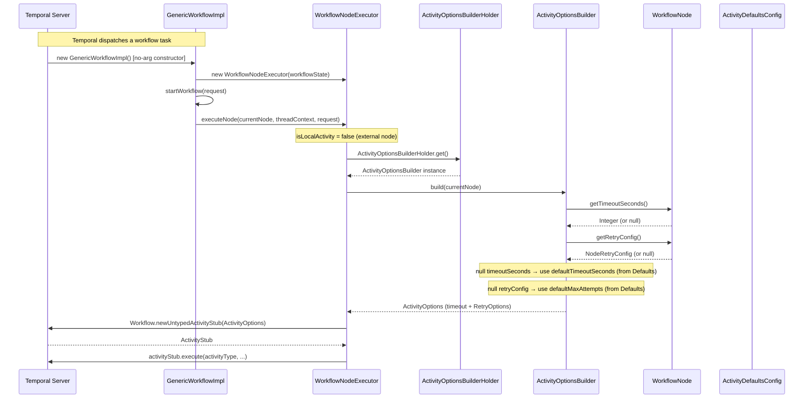

# Low-Level Design: Retry and Timeout Configuration for Drift Workflows

**Feature tag:** retry-timeout-config
**Branch:** feature/retry-timeout-config
**Author:** Ashwini Borla
**Date:** 2026-05-19
**Status:** DRAFT — awaiting Confluence LGTM
**PRD:** [retry-timeout-config-prd-expanded.md](https://flipkart.atlassian.net/wiki/pages/viewpage.action?pageId=474620696)
**HLD:** [retry-timeout-config-hld.md](https://flipkart.atlassian.net/wiki/pages/viewpage.action?pageId=474588363)

---

## 1. Scope Summary

This LLD covers the complete implementation of per-node retry and timeout configuration in the Drift workflow DSL. Specifically it specifies every class to create or modify across the `commons` and `worker` modules, the exact field and method signatures, Jackson and Lombok annotations, the static holder initialisation sequence, and the full unit test scenarios for `ActivityOptionsBuilder`. It deliberately excludes: `localActivityOptions` changes (INSTRUCTION, BRANCH, GROOVY node types), workflow-level `WorkflowOptions`, dynamic config refresh (Archaius), `retryConfig` on `NodeDefinition` subtypes, and any UI changes to the Drift management console.

---

## 2. Layer Decomposition

| Layer | Label | Files touched |
|---|---|---|
| 1 | commons — new POJO | `commons/src/main/java/com/flipkart/drift/commons/model/node/NodeRetryConfig.java` (CREATE) |
| 1 | commons — WorkflowNode | `commons/src/main/java/com/flipkart/drift/commons/model/node/WorkflowNode.java` (MODIFY) |
| 2 | worker-config — new POJO | `worker/src/main/java/com/flipkart/drift/worker/config/ActivityDefaultsConfig.java` (CREATE) |
| 2 | worker-config — DriftWorkerConfiguration | `worker/src/main/java/com/flipkart/drift/worker/config/DriftWorkerConfiguration.java` (MODIFY) |
| 3 | worker-temporal — builder | `worker/src/main/java/com/flipkart/drift/worker/temporal/ActivityOptionsBuilder.java` (CREATE) |
| 3 | worker-temporal — holder | `worker/src/main/java/com/flipkart/drift/worker/temporal/ActivityOptionsBuilderHolder.java` (CREATE) |
| 4 | worker-integration — bootstrap | `worker/src/main/java/com/flipkart/drift/worker/bootstrap/TemporalWorkerManaged.java` (MODIFY) |
| 4 | worker-integration — executor | `worker/src/main/java/com/flipkart/drift/worker/workflows/WorkflowNodeExecutor.java` (MODIFY) |
| 4 | worker-integration — tests | `worker/src/test/java/com/flipkart/drift/worker/temporal/ActivityOptionsBuilderTest.java` (CREATE) |

---

## 3. New Classes — Full Specifications

### 3.1 NodeRetryConfig

**File:** `commons/src/main/java/com/flipkart/drift/commons/model/node/NodeRetryConfig.java`
**Package:** `com.flipkart.drift.commons.model.node`

```java
package com.flipkart.drift.commons.model.node;

import com.fasterxml.jackson.annotation.JsonIgnoreProperties;
import com.fasterxml.jackson.annotation.JsonProperty;
import lombok.AllArgsConstructor;
import lombok.Data;
import lombok.NoArgsConstructor;

/**
 * Per-node retry policy sourced from the WorkflowNode DSL stored in HBase.
 *
 * Only maxAttempts is required when retryConfig is present in the DSL.
 * The remaining fields default to Temporal SDK-conventional values so that
 * a minimal {"maxAttempts": 3} JSON produces a fully-valid RetryOptions.
 *
 * Jackson deserialisation contract:
 *   - A JSON object with only "maxAttempts" set deserialises to
 *     NodeRetryConfig(maxAttempts=N, initialIntervalSeconds=1, maxIntervalSeconds=20, backoffCoefficient=2.0).
 *   - An absent retryConfig field on WorkflowNode deserialises as null (no retryConfig object present).
 */
@Data
@NoArgsConstructor
@AllArgsConstructor
@JsonIgnoreProperties(ignoreUnknown = true)
public class NodeRetryConfig {

    /** Required. Number of total attempts (1 = no retry, 2 = one retry, etc.). */
    @JsonProperty("maxAttempts")
    private int maxAttempts;

    /** Initial backoff interval between retries. Defaults to 1 second. */
    @JsonProperty("initialIntervalSeconds")
    private int initialIntervalSeconds = 1;

    /** Maximum backoff interval cap. Defaults to 20 seconds. */
    @JsonProperty("maxIntervalSeconds")
    private int maxIntervalSeconds = 20;

    /** Exponential backoff multiplier. Defaults to 2.0. */
    @JsonProperty("backoffCoefficient")
    private double backoffCoefficient = 2.0;
}
```

**Design notes:**
- Default values are Java field initialisers, not `@JsonProperty(defaultValue=...)`. This ensures Jackson partial deserialisation works correctly: a JSON `{"maxAttempts":3}` produces `NodeRetryConfig(3, 1, 20, 2.0)`.
- `@AllArgsConstructor` from Lombok generates a constructor with all four fields; used in tests.
- `commons` must not import any Temporal SDK type — `NodeRetryConfig` has no Temporal imports.

---

### 3.2 ActivityDefaultsConfig

**File:** `worker/src/main/java/com/flipkart/drift/worker/config/ActivityDefaultsConfig.java`
**Package:** `com.flipkart.drift.worker.config`

```java
package com.flipkart.drift.worker.config;

import com.fasterxml.jackson.annotation.JsonIgnoreProperties;
import com.fasterxml.jackson.annotation.JsonProperty;
import lombok.AllArgsConstructor;
import lombok.Data;
import lombok.NoArgsConstructor;

/**
 * Operator-tunable platform-level defaults for external-node activity stubs.
 *
 * These are injected via DriftWorkerConfiguration (Dropwizard YAML). The field
 * is optional — omitting the activityDefaults block entirely in YAML is valid;
 * the JVM defaults here (1 attempt, 10 seconds) preserve existing behaviour.
 *
 * Only affects external-node activity stubs (WorkflowNodeExecutor.executeNode).
 * Internal activities (ReturnControl, WorkflowContextManager, FetchWorkflow) are
 * unaffected.
 */
@Data
@NoArgsConstructor
@AllArgsConstructor
@JsonIgnoreProperties(ignoreUnknown = true)
public class ActivityDefaultsConfig {

    /**
     * Default maximum attempts for external-node activities.
     * Maps to YAML key: activityDefaults.defaultMaxAttempts
     * Default: 1 (no retry — matches current activityOptionsV1 behaviour).
     */
    @JsonProperty("defaultMaxAttempts")
    private int defaultMaxAttempts = 1;

    /**
     * Default startToCloseTimeout in seconds for external-node activities.
     * Maps to YAML key: activityDefaults.defaultTimeoutSeconds
     * Default: 10 (matches current activityOptionsV1 behaviour).
     */
    @JsonProperty("defaultTimeoutSeconds")
    private int defaultTimeoutSeconds = 10;
}
```

---

### 3.3 ActivityOptionsBuilder

**File:** `worker/src/main/java/com/flipkart/drift/worker/temporal/ActivityOptionsBuilder.java`
**Package:** `com.flipkart.drift.worker.temporal`

```java
package com.flipkart.drift.worker.temporal;

import com.flipkart.drift.commons.model.node.NodeRetryConfig;
import com.flipkart.drift.commons.model.node.WorkflowNode;
import com.flipkart.drift.worker.config.ActivityDefaultsConfig;
import io.temporal.activity.ActivityOptions;
import io.temporal.common.RetryOptions;

import java.time.Duration;

/**
 * Builds Temporal ActivityOptions for external-node activity stubs by merging
 * per-node DSL config (WorkflowNode) with platform-level defaults
 * (ActivityDefaultsConfig sourced from Dropwizard YAML).
 *
 * Resolution priority (highest wins):
 *   node.timeoutSeconds     > defaults.defaultTimeoutSeconds   (10 s if absent)
 *   node.retryConfig.*      > defaults.defaultMaxAttempts      (1 if absent)
 *
 * This class is intentionally a plain Java class with no Guice, Spring, or
 * Temporal annotations. It can be instantiated and tested without any framework.
 */
public class ActivityOptionsBuilder {

    private static final int FALLBACK_TIMEOUT_SECONDS = 10;
    private static final int FALLBACK_MAX_ATTEMPTS = 1;
    private static final int FALLBACK_INITIAL_INTERVAL_SECONDS = 1;
    private static final int FALLBACK_MAX_INTERVAL_SECONDS = 20;
    private static final double FALLBACK_BACKOFF_COEFFICIENT = 2.0;

    private final int defaultTimeoutSeconds;
    private final int defaultMaxAttempts;

    /**
     * Constructs a builder with the given platform defaults.
     *
     * @param defaults platform-level defaults from DriftWorkerConfiguration;
     *                 may be null (treated as absent activityDefaults block in YAML).
     */
    public ActivityOptionsBuilder(ActivityDefaultsConfig defaults) {
        if (defaults != null) {
            this.defaultTimeoutSeconds = defaults.getDefaultTimeoutSeconds();
            this.defaultMaxAttempts = defaults.getDefaultMaxAttempts();
        } else {
            this.defaultTimeoutSeconds = FALLBACK_TIMEOUT_SECONDS;
            this.defaultMaxAttempts = FALLBACK_MAX_ATTEMPTS;
        }
    }

    /**
     * Builds ActivityOptions for the given WorkflowNode by merging node-level
     * DSL config with platform defaults.
     *
     * Node-level values always win over platform defaults when present.
     * Absent node-level values fall back to the platform defaults supplied
     * at construction time.
     *
     * @param node the WorkflowNode being executed; must not be null.
     * @return fully-built ActivityOptions ready for use in an activity stub.
     */
    public ActivityOptions build(WorkflowNode node) {
        NodeRetryConfig retryConfig = node.getRetryConfig();

        int timeout = node.getTimeoutSeconds() != null
                ? node.getTimeoutSeconds()
                : this.defaultTimeoutSeconds;

        int maxAttempts = retryConfig != null
                ? retryConfig.getMaxAttempts()
                : this.defaultMaxAttempts;

        int initialInterval = retryConfig != null
                ? retryConfig.getInitialIntervalSeconds()
                : FALLBACK_INITIAL_INTERVAL_SECONDS;

        int maxInterval = retryConfig != null
                ? retryConfig.getMaxIntervalSeconds()
                : FALLBACK_MAX_INTERVAL_SECONDS;

        double backoff = retryConfig != null
                ? retryConfig.getBackoffCoefficient()
                : FALLBACK_BACKOFF_COEFFICIENT;

        return ActivityOptions.newBuilder()
                .setStartToCloseTimeout(Duration.ofSeconds(timeout))
                .setRetryOptions(RetryOptions.newBuilder()
                        .setMaximumAttempts(maxAttempts)
                        .setInitialInterval(Duration.ofSeconds(initialInterval))
                        .setMaximumInterval(Duration.ofSeconds(maxInterval))
                        .setBackoffCoefficient(backoff)
                        .build())
                .build();
    }
}
```

**Design notes:**
- `initialIntervalSeconds` and `maxIntervalSeconds` always come from the node's `retryConfig` (using its Java defaults when partially specified) or the fixed constants — they never come from `ActivityDefaultsConfig`. Only `maxAttempts` and `timeoutSeconds` are operator-tunable via YAML.
- No Temporal SDK types on the class itself — only the return type and parameter types of `build()` reference Temporal classes.

---

### 3.4 ActivityOptionsBuilderHolder

**File:** `worker/src/main/java/com/flipkart/drift/worker/temporal/ActivityOptionsBuilderHolder.java`
**Package:** `com.flipkart.drift.worker.temporal`

```java
package com.flipkart.drift.worker.temporal;

/**
 * Static holder for the singleton ActivityOptionsBuilder instance.
 *
 * This pattern is required because Temporal workflows must have a no-arg
 * constructor (GenericWorkflowImpl()), which means WorkflowNodeExecutor
 * cannot receive Guice-injected dependencies via normal constructor injection.
 *
 * Lifecycle:
 *   1. TemporalWorkerManaged.start() calls init() BEFORE workerFactory.start().
 *   2. Temporal starts polling for workflow tasks only after workerFactory.start().
 *   3. WorkflowNodeExecutor.executeNode() calls get() during workflow task execution.
 *
 * Thread safety: INSTANCE is declared volatile. init() is called once on the
 * Dropwizard-managed thread before any Temporal thread reads INSTANCE. This is
 * safe without explicit synchronisation because the Dropwizard lifecycle guarantee
 * (start() completes before the worker polls) establishes the happens-before edge.
 *
 * Test usage: tests that instantiate WorkflowNodeExecutor must call
 *   ActivityOptionsBuilderHolder.init(new ActivityOptionsBuilder(null))
 * in a @BeforeEach method to prevent IllegalStateException.
 */
public final class ActivityOptionsBuilderHolder {

    private static volatile ActivityOptionsBuilder INSTANCE = null;

    private ActivityOptionsBuilderHolder() {
        // static holder — no instances
    }

    /**
     * Initialises the holder with the given builder instance.
     * Replaces any existing instance (safe for repeated calls in tests).
     *
     * @param builder the ActivityOptionsBuilder to store; must not be null.
     */
    public static void init(ActivityOptionsBuilder builder) {
        INSTANCE = builder;
    }

    /**
     * Returns the initialised ActivityOptionsBuilder instance.
     *
     * @return the singleton ActivityOptionsBuilder.
     * @throws IllegalStateException if init() has not been called yet.
     */
    public static ActivityOptionsBuilder get() {
        ActivityOptionsBuilder instance = INSTANCE;
        if (instance == null) {
            throw new IllegalStateException(
                    "ActivityOptionsBuilderHolder not initialised — " +
                    "call init() before starting the Temporal worker."
            );
        }
        return instance;
    }
}
```

---

## 4. Modified Classes — Exact Diffs

### 4.1 WorkflowNode

**File:** `commons/src/main/java/com/flipkart/drift/commons/model/node/WorkflowNode.java`

Current fields: `instanceName`, `resourceId`, `resourceVersion`, `type`, `parameters`, `contextOverrideKey`, `nextNode`, `end`, `nodeDefinition`.

**Changes:** add two fields after `end`. No other lines change.

```java
// --- ADD after the existing 'end' field ---

    /**
     * Optional per-node timeout in seconds for the Temporal activity stub.
     * When null, falls back to ActivityDefaultsConfig.defaultTimeoutSeconds (YAML default: 10).
     * Use Integer (not int) so null means "not set in DSL".
     */
    @JsonProperty("timeoutSeconds")
    private Integer timeoutSeconds;

    /**
     * Optional per-node retry policy for the Temporal activity stub.
     * When null, falls back to ActivityDefaultsConfig.defaultMaxAttempts (YAML default: 1).
     */
    @JsonProperty("retryConfig")
    private NodeRetryConfig retryConfig;
```

**Import to add:**

```java
import com.fasterxml.jackson.annotation.JsonProperty;
import com.flipkart.drift.commons.model.node.NodeRetryConfig;
```

**Complete updated file for reference:**

```java
package com.flipkart.drift.commons.model.node;

import com.fasterxml.jackson.annotation.JsonIgnoreProperties;
import com.fasterxml.jackson.annotation.JsonProperty;
import com.flipkart.drift.commons.model.enums.WorkflowNodeType;
import lombok.AllArgsConstructor;
import lombok.Data;
import lombok.NoArgsConstructor;

import java.util.Map;

@Data
@AllArgsConstructor
@NoArgsConstructor
@JsonIgnoreProperties(ignoreUnknown = true)
public class WorkflowNode {
    private String instanceName;
    private String resourceId;
    private String resourceVersion;
    private WorkflowNodeType type;
    private Map<String, String> parameters;
    private String contextOverrideKey;
    private String nextNode;
    private boolean end;
    NodeDefinition nodeDefinition; // Populated in FetchWorkflowActivity

    @JsonProperty("timeoutSeconds")
    private Integer timeoutSeconds;

    @JsonProperty("retryConfig")
    private NodeRetryConfig retryConfig;
}
```

**Backward compatibility:** `@JsonIgnoreProperties(ignoreUnknown = true)` is already present. Old HBase JSON without `retryConfig` or `timeoutSeconds` deserialises both new fields as `null`. `ActivityOptionsBuilder.build()` falls back to platform defaults when both are null — identical to the current `activityOptionsV1` behaviour.

---

### 4.2 DriftWorkerConfiguration

**File:** `worker/src/main/java/com/flipkart/drift/worker/config/DriftWorkerConfiguration.java`

**Change:** add one optional field (no `@NotNull`).

```java
// --- ADD at the end of the field block, before the closing brace ---

    /**
     * Optional platform-level defaults for external-node activity stubs.
     * Omitting this block in YAML is valid; JVM defaults (1 attempt, 10 s) apply.
     */
    private ActivityDefaultsConfig activityDefaults;
```

`@Getter` and `@Setter` are already on the class — `getActivityDefaults()` and `setActivityDefaults()` are generated automatically.

`ActivityDefaultsConfig` is in the same package (`com.flipkart.drift.worker.config`) — no import needed.

---

### 4.3 TemporalWorkerManaged

**File:** `worker/src/main/java/com/flipkart/drift/worker/bootstrap/TemporalWorkerManaged.java`

**Problem:** `configuration` is currently a constructor parameter that is passed directly to `createWorkerFactory()` and not stored as a field. `start()` therefore has no access to it.

**Changes:**

1. Add a `private final DriftWorkerConfiguration configuration` field.
2. Assign it in the constructor before calling `createWorkerFactory()`.
3. In `start()`, call `ActivityOptionsBuilderHolder.init()` before `workerFactory.start()`.

```java
// --- FIELD to add ---
private final DriftWorkerConfiguration configuration;

// --- CONSTRUCTOR change ---
public TemporalWorkerManaged(Injector injector, DriftWorkerConfiguration configuration, Scope metricsScope) {
    this.configuration = configuration;                                                   // ADD THIS LINE
    this.workerFactory = createWorkerFactory(injector, configuration, metricsScope);
    this.terminationTimeoutInSec = configuration.getAwaitTerminationTimeoutInSec();
}

// --- start() change ---
@Override
public void start() {
    log.info("Starting Temporal Worker");
    ActivityOptionsBuilderHolder.init(                                                    // ADD THESE TWO LINES
            new ActivityOptionsBuilder(this.configuration.getActivityDefaults()));
    workerFactory.start();
    log.info("Started Temporal Worker !!!!");
}
```

**Imports to add:**

```java
import com.flipkart.drift.worker.temporal.ActivityOptionsBuilder;
import com.flipkart.drift.worker.temporal.ActivityOptionsBuilderHolder;
```

**Initialisation ordering guarantee:** `ActivityOptionsBuilderHolder.init()` runs on the Dropwizard-managed thread during `start()`. Temporal's `workerFactory.start()` is the call that begins polling the Temporal server for workflow tasks. Because `init()` completes before `workerFactory.start()` is reached, `ActivityOptionsBuilderHolder.INSTANCE` is guaranteed to be non-null by the time any workflow task dispatches `WorkflowNodeExecutor.executeNode()`.

---

### 4.4 WorkflowNodeExecutor

**File:** `worker/src/main/java/com/flipkart/drift/worker/workflows/WorkflowNodeExecutor.java`

Two call sites replace `OptionsStore.activityOptionsV1` with the builder.

**Change 1 — `executeNode()` private method (line 82):**

```java
// BEFORE:
ActivityStub activityStub = isLocalActivity ?
        io.temporal.workflow.Workflow.newUntypedLocalActivityStub(OptionsStore.localActivityOptions) :
        io.temporal.workflow.Workflow.newUntypedActivityStub(OptionsStore.activityOptionsV1);

// AFTER:
ActivityStub activityStub = isLocalActivity ?
        io.temporal.workflow.Workflow.newUntypedLocalActivityStub(OptionsStore.localActivityOptions) :
        io.temporal.workflow.Workflow.newUntypedActivityStub(
                ActivityOptionsBuilderHolder.get().build(currentNode));
```

**Change 2 — `executeWorkflowNode()` (disconnected nodes, line 158):**

```java
// BEFORE:
ActivityStub untypedActivityStub = io.temporal.workflow.Workflow.newUntypedActivityStub(OptionsStore.activityOptionsV1);

// AFTER:
ActivityStub untypedActivityStub = io.temporal.workflow.Workflow.newUntypedActivityStub(
        ActivityOptionsBuilderHolder.get().build(workflowNode));
```

**Import to add:**

```java
import com.flipkart.drift.worker.temporal.ActivityOptionsBuilderHolder;
```

`OptionsStore` import stays — it is still referenced for `localActivityOptions` (line 81) and for all `ReturnControlActivity`, `WorkflowContextManagerActivity`, and `FetchWorkflowActivity` stubs which continue to use `OptionsStore.activityOptions`.

---

## 5. YAML Configuration

### 5.1 Worker configuration.yaml addition

Add the following block to `worker/src/main/resources/config/configuration.yaml` after the `workerDynamicOptions` section:

```yaml
# Optional — per-node activity defaults for external-node Temporal stubs.
# Omitting this block is valid; JVM defaults (1 attempt, 10 s) apply,
# preserving existing activityOptionsV1 behaviour.
activityDefaults:
  defaultMaxAttempts: 1
  defaultTimeoutSeconds: 10
```

### 5.2 HBase DSL JSON examples

**Full per-node override** (all fields set, platform defaults ignored):

```json
{
  "instanceName": "call-vendor-api",
  "type": "HTTP",
  "resourceId": "vendor-http-node",
  "resourceVersion": "1.0",
  "timeoutSeconds": 45,
  "retryConfig": {
    "maxAttempts": 3,
    "initialIntervalSeconds": 2,
    "maxIntervalSeconds": 30,
    "backoffCoefficient": 2.0
  },
  "nextNode": "check-response"
}
```

**Minimal retry** (only `maxAttempts` set; `initialIntervalSeconds`, `maxIntervalSeconds`, `backoffCoefficient` use `NodeRetryConfig` Java field defaults):

```json
{
  "instanceName": "call-vendor-api",
  "type": "HTTP",
  "resourceId": "vendor-http-node",
  "resourceVersion": "1.0",
  "retryConfig": { "maxAttempts": 3 },
  "nextNode": "check-response"
}
```

Result: `ActivityOptions` with `startToCloseTimeout=10s` (platform default), `maxAttempts=3`, `initialInterval=1s`, `maxInterval=20s`, `backoffCoefficient=2.0`.

**Timeout only** (no retry config, timeout overridden):

```json
{
  "instanceName": "slow-vendor-call",
  "type": "HTTP",
  "resourceId": "slow-http-node",
  "resourceVersion": "1.0",
  "timeoutSeconds": 60,
  "nextNode": "next-step"
}
```

Result: `ActivityOptions` with `startToCloseTimeout=60s`, `maxAttempts=1` (platform default).

---

## 6. Sequence Diagram — Options Resolution Path



---

## 7. Unit Test Scenarios

**File:** `worker/src/test/java/com/flipkart/drift/worker/temporal/ActivityOptionsBuilderTest.java`
**Package:** `com.flipkart.drift.worker.temporal`
**Framework:** JUnit 5, no Mockito, no Temporal test server.

```java
package com.flipkart.drift.worker.temporal;

import com.flipkart.drift.commons.model.node.NodeRetryConfig;
import com.flipkart.drift.commons.model.node.WorkflowNode;
import com.flipkart.drift.worker.config.ActivityDefaultsConfig;
import io.temporal.activity.ActivityOptions;
import org.junit.jupiter.api.Test;

import java.time.Duration;

import static org.junit.jupiter.api.Assertions.assertEquals;

/**
 * Pure unit tests for ActivityOptionsBuilder.
 *
 * No Temporal test server or Guice context required.
 * Each test constructs the builder and a plain WorkflowNode directly.
 *
 * Note for WorkflowNodeExecutor tests: any test that triggers the external-node
 * path in WorkflowNodeExecutor must call
 *   ActivityOptionsBuilderHolder.init(new ActivityOptionsBuilder(null))
 * in a @BeforeEach method to prevent IllegalStateException.
 */
class ActivityOptionsBuilderTest {

    // --- Helper: build a WorkflowNode with the specified optional fields ---
    private WorkflowNode node(Integer timeoutSeconds, NodeRetryConfig retryConfig) {
        WorkflowNode n = new WorkflowNode();
        n.setTimeoutSeconds(timeoutSeconds);
        n.setRetryConfig(retryConfig);
        return n;
    }

    // --- Helper: build a NodeRetryConfig with all fields ---
    private NodeRetryConfig retry(int maxAttempts, int initialInterval, int maxInterval, double backoff) {
        return new NodeRetryConfig(maxAttempts, initialInterval, maxInterval, backoff);
    }

    // --- Helper: build a minimal NodeRetryConfig using Java field defaults ---
    private NodeRetryConfig retryMinimal(int maxAttempts) {
        NodeRetryConfig r = new NodeRetryConfig();
        r.setMaxAttempts(maxAttempts);
        return r;
    }

    /**
     * TC-1: Node-level timeout wins over platform default.
     */
    @Test
    void nodeLevelTimeoutWins() {
        ActivityDefaultsConfig defaults = new ActivityDefaultsConfig(1, 10);
        ActivityOptionsBuilder builder = new ActivityOptionsBuilder(defaults);

        ActivityOptions options = builder.build(node(45, null));

        assertEquals(Duration.ofSeconds(45), options.getStartToCloseTimeout());
        assertEquals(1, options.getRetryOptions().getMaximumAttempts());
    }

    /**
     * TC-2: Node-level retry wins over platform default.
     */
    @Test
    void nodeLevelRetryWins() {
        ActivityDefaultsConfig defaults = new ActivityDefaultsConfig(1, 10);
        ActivityOptionsBuilder builder = new ActivityOptionsBuilder(defaults);

        ActivityOptions options = builder.build(node(null, retryMinimal(3)));

        assertEquals(Duration.ofSeconds(10), options.getStartToCloseTimeout());
        assertEquals(3, options.getRetryOptions().getMaximumAttempts());
    }

    /**
     * TC-3: Partial override — timeout set, retry absent.
     * Timeout comes from node; maxAttempts comes from platform default.
     */
    @Test
    void partialOverrideTimeoutOnly() {
        ActivityDefaultsConfig defaults = new ActivityDefaultsConfig(2, 10);
        ActivityOptionsBuilder builder = new ActivityOptionsBuilder(defaults);

        ActivityOptions options = builder.build(node(20, null));

        assertEquals(Duration.ofSeconds(20), options.getStartToCloseTimeout());
        assertEquals(2, options.getRetryOptions().getMaximumAttempts());
    }

    /**
     * TC-4: Partial override — retry set, timeout absent.
     * maxAttempts comes from node; timeout comes from platform default.
     */
    @Test
    void partialOverrideRetryOnly() {
        ActivityDefaultsConfig defaults = new ActivityDefaultsConfig(1, 30);
        ActivityOptionsBuilder builder = new ActivityOptionsBuilder(defaults);

        ActivityOptions options = builder.build(node(null, retryMinimal(5)));

        assertEquals(Duration.ofSeconds(30), options.getStartToCloseTimeout());
        assertEquals(5, options.getRetryOptions().getMaximumAttempts());
    }

    /**
     * TC-5: All defaults — no node config, null ActivityDefaultsConfig (YAML block absent).
     * Must behave identically to current activityOptionsV1 (10 s, 1 attempt).
     */
    @Test
    void allDefaultsNoNodeConfigNoYaml() {
        ActivityOptionsBuilder builder = new ActivityOptionsBuilder(null);

        ActivityOptions options = builder.build(node(null, null));

        assertEquals(Duration.ofSeconds(10), options.getStartToCloseTimeout());
        assertEquals(1, options.getRetryOptions().getMaximumAttempts());
    }

    /**
     * TC-6: YAML defaults only — no node config, platform defaults from YAML.
     */
    @Test
    void yamlDefaultsOnlyNoNodeConfig() {
        ActivityDefaultsConfig defaults = new ActivityDefaultsConfig(2, 30);
        ActivityOptionsBuilder builder = new ActivityOptionsBuilder(defaults);

        ActivityOptions options = builder.build(node(null, null));

        assertEquals(Duration.ofSeconds(30), options.getStartToCloseTimeout());
        assertEquals(2, options.getRetryOptions().getMaximumAttempts());
    }

    /**
     * TC-7: Full node override — all node fields set, platform defaults ignored.
     */
    @Test
    void fullNodeOverride() {
        ActivityDefaultsConfig defaults = new ActivityDefaultsConfig(1, 10);
        ActivityOptionsBuilder builder = new ActivityOptionsBuilder(defaults);
        NodeRetryConfig retryConfig = retry(5, 3, 60, 1.5);

        ActivityOptions options = builder.build(node(60, retryConfig));

        assertEquals(Duration.ofSeconds(60), options.getStartToCloseTimeout());
        assertEquals(5,   options.getRetryOptions().getMaximumAttempts());
        assertEquals(Duration.ofSeconds(3),  options.getRetryOptions().getInitialInterval());
        assertEquals(Duration.ofSeconds(60), options.getRetryOptions().getMaximumInterval());
        assertEquals(1.5, options.getRetryOptions().getBackoffCoefficient(), 0.001);
    }
}
```

---

## 8. ArchUnit Impact Assessment

All existing `WorkerArchTest` rules are satisfied by the new code:

| Rule | Assessment |
|---|---|
| Rule 1: worker must not depend on api | PASS — no `com.flipkart.drift.api` imports in any new or modified class. |
| Rule 2: no `System.currentTimeMillis()` in workflows package | PASS — no new calls to `System.currentTimeMillis()` in `WorkflowNodeExecutor` (workflows package). `ActivityOptionsBuilder` and `ActivityOptionsBuilderHolder` are in the `temporal` package, not `workflows`. |
| Rule 3: no `Thread.sleep()` in workflows package | PASS — no `Thread.sleep()` added anywhere. |
| Rule 4: no direct HBase `Table` access | PASS — no HBase imports in any new class. |

**Potential future ArchUnit rule (out of scope for this feature):**

```java
// Suggested future rule: only bootstrap classes may call ActivityOptionsBuilderHolder.init()
noClasses()
    .that().resideInAPackage("com.flipkart.drift.worker.workflows..")
    .should().callMethod(ActivityOptionsBuilderHolder.class, "init", ActivityOptionsBuilder.class)
    .as("Only bootstrap code (TemporalWorkerManaged) may initialise the holder");
```

This would prevent accidental calls to `init()` from within workflow or activity code, which could silently swap the builder mid-execution.

---

## 9. Implementation Order and Dependencies

| Step | Layer | Deliverable | Depends On | Build target |
|---|---|---|---|---|
| 1 | commons | `NodeRetryConfig` (CREATE) | — | `mvn clean package -DskipTests -pl commons -am` |
| 2 | commons | `WorkflowNode` (ADD 2 fields) | Step 1 | `mvn clean package -DskipTests -pl commons -am` |
| 3 | worker-config | `ActivityDefaultsConfig` (CREATE) | — | `mvn clean package -DskipTests -pl worker -am` |
| 4 | worker-config | `DriftWorkerConfiguration` (ADD field) | Step 3 | `mvn clean package -DskipTests -pl worker -am` |
| 5 | worker-temporal | `ActivityOptionsBuilder` (CREATE) | Steps 2, 3 | `mvn clean package -DskipTests -pl worker -am` |
| 6 | worker-temporal | `ActivityOptionsBuilderHolder` (CREATE) | Step 5 | `mvn clean package -DskipTests -pl worker -am` |
| 7 | worker-integration | `TemporalWorkerManaged` (ADD field + init call) | Steps 4, 6 | `mvn clean package -DskipTests -pl worker -am` |
| 8 | worker-integration | `WorkflowNodeExecutor` (REPLACE activityOptionsV1 stubs) | Step 6 | `mvn clean package -DskipTests -pl worker -am` |
| 9 | worker-integration | `ActivityOptionsBuilderTest` (CREATE — 7 test cases) | Steps 5, 6 | `mvn test -pl worker -am` |

Steps 1–2 (commons) and Steps 3–4 (worker-config) can be committed as a single Layer 1+2 commit. Steps 5–6 (temporal layer) form Layer 3. Steps 7–9 (integration) form Layer 4.

---

## 10. Acceptance Criteria Traceability

| AC | Criterion | Implemented by |
|---|---|---|
| AC-1 | `retryConfig.maxAttempts=3`, `timeoutSeconds=45` → stub with `startToClose=45s`, `maxAttempts=3`, `initialInterval=1s`, `maxInterval=20s`, `backoff=2.0` | `ActivityOptionsBuilder.build()` + TC-7 |
| AC-2 | No `retryConfig`, no `timeoutSeconds` → platform defaults (1 attempt, 10 s) | `ActivityOptionsBuilder` fallback path + TC-5 |
| AC-3 | `activityDefaults.defaultTimeoutSeconds=30` in YAML → effective timeout 30 s for unconfigured nodes | `ActivityDefaultsConfig` + `DriftWorkerConfiguration` field + TC-6 |
| AC-4 | `ReturnControlActivity`, `WorkflowContextManagerActivity`, `FetchWorkflowActivity` unaffected | `WorkflowNodeExecutor` — only the two `activityOptionsV1` stubs are replaced; all `OptionsStore.activityOptions` call sites are untouched |
| AC-5 | INSTRUCTION, BRANCH, GROOVY, SUCCESS, FAILURE → `localActivityOptions` unchanged | `WorkflowNodeExecutor.executeNode()` — local-activity branch still uses `OptionsStore.localActivityOptions` |
| AC-6 | All existing unit tests pass | Backward-compatible null handling in `ActivityOptionsBuilder` + TC-5 |
| AC-7 | New unit tests for `ActivityOptionsBuilder` | `ActivityOptionsBuilderTest` TC-1 through TC-7 |
