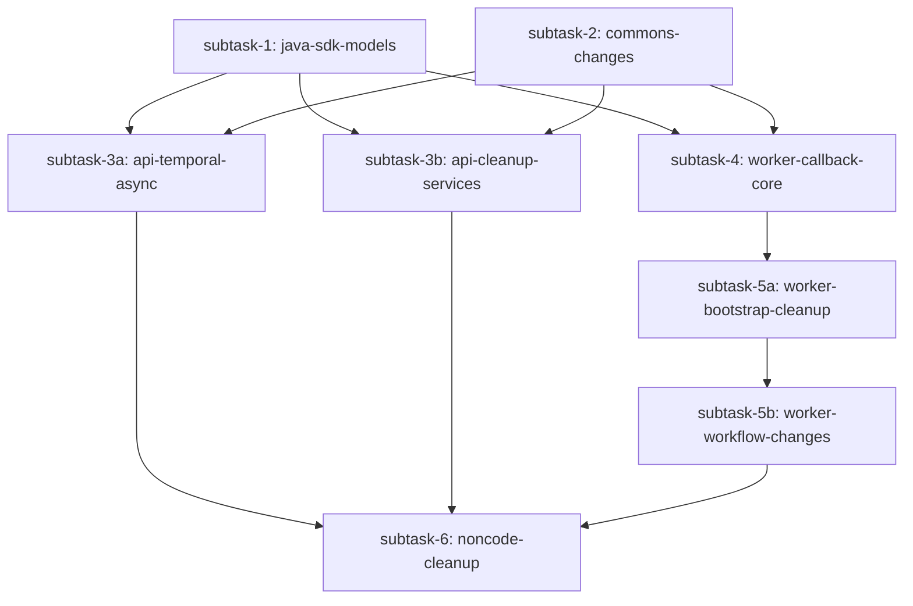

# Execution Plan: Redis Removal from Drift

**Feature tag:** `redis-removal`
**Created:** 2026-05-24
**Status:** COMPLETE
**Planner version:** 1.0 (revision 2 — subtask-3 and subtask-5 split per evaluator feedback)
**PRD:** `harness-docs/design/active/redis-removal-prd-expanded.md`
**HLD:** `harness-docs/design/active/redis-removal-hld.md`
**LLD:** `harness-docs/design/active/redis-removal-lld.md`

---

## Requirement Summary

Remove Redis (Jedis 3.3.0 / Sentinel) entirely from Drift by converting workflow execution to async-only (202 Accepted immediately), replacing the sync-wait pub/sub signal with an optional HTTP `CallbackActivity`, relying on the existing Guava cache TTL for DSL convergence, and purging all Jedis code, config, and Maven dependencies from every module.

---

## Clarifications & Resolved Ambiguities

All requirements are fully specified in the PRD/HLD/LLD. Key decisions carried forward from design documents:

| # | Ambiguity | Question Asked | User Response | Impact on Plan | Timestamp |
|---|-----------|---------------|---------------|----------------|-----------|
| 1 | CallbackActivity failure propagation | Should try-catch wrap invokeCallbackIfPresent? | NO try-catch. ActivityFailure propagates — callback failure = workflow fails, identical to any other Temporal activity failure | invokeCallbackIfPresent has NO try-catch wrapper | 2026-05-24 (LLD §4 + user instruction) |
| 2 | CallbackPayload fields | Include disposition and view in payload? | CallbackPayload includes ONLY: workflowId, workflowStatus, errorMessage | CallbackPayload has 3 fields only | 2026-05-24 (LLD §2 + PRD clarification) |

---

## External Dependencies (confirmed with user)

| Service | Type | Local Access Mode | Config Details | User Confirmed |
|---------|------|-------------------|----------------|----------------|
| Redis Sentinel | cache/pubsub | **REMOVED** — no longer a dependency | All REDIS_* env vars removed | yes (central goal of the feature) |
| Temporal Frontend | gRPC workflow engine | Unchanged — existing local config | TEMPORAL_FRONTEND, TEMPORAL_TASK_QUEUE env vars | yes |
| HBase | Persistence | Unchanged — existing local config | HBASE_CONFIG_BUCKET env var | yes |

---

## Affected Modules

| Module | Impact | Layer |
|--------|--------|-------|
| `java-sdk` | Add `callbackUrl` field to `WorkflowStartRequest`; add `WorkflowStartResponse` and `WorkflowResumeResponse` | Model / SDK |
| `commons` | Add `callbackUrl` field to `WorkflowState`; delete `RedisStoreException`; delete Redis constants in `Constants.Workflow` | Domain model |
| `api` | Delete `RedisPubSubService`, `RedisConfiguration`; modify `TemporalService`, `WorkflowResource`, `WorkflowClientModule`, `DriftConfiguration`, `NodeDefinitionService`, `WorkflowDefinitionService`, `Utility` | Service / Resource / Config / DI |
| `worker` | Add `CallbackActivity`, `CallbackActivityImpl`, `CallbackPayload`, `CallbackConfig`; delete `RedisCacheInvalidator`, `RedisConfiguration`, `ReturnControlActivity`, `ReturnControlActivityImpl`; modify `GenericWorkflowImpl`, `WorkflowNodeExecutor`, `WorkerModule`, `DriftWorkerConfiguration`, `WorkerApplication`, `TemporalWorkerManaged`, `OptionsStore` | Activity / Workflow / Config / DI |
| Non-code files | Delete Redis blocks from YAML configs; remove Jedis from pom.xml; update connections.md | Config / Build |

---

## Subtask DAG



**Ordering rationale:**
- Layer 0: `java-sdk` models + `commons` changes — foundational contracts. Both must compile before any module depending on them.
- Layer 1: `api-temporal-async` (core async conversion), `api-cleanup-services` (builder Redis removal), and `worker-callback-core` (new callback classes) — all depend only on Layer 0. All three run in parallel.
- Layer 2: `worker-bootstrap-cleanup` — depends on `worker-callback-core` (CallbackActivityImpl must exist before it can be registered in TemporalWorkerManaged). Runs after Layer 1.
- Layer 3: `worker-workflow-changes` — depends on `worker-bootstrap-cleanup` (OptionsStore.callbackActivityOptions must exist before WorkflowNodeExecutor references it).
- Layer 4: `noncode-cleanup` — FINAL. Jedis removal from pom.xml is the safety net. All code must compile clean first.

---

## Parallel Execution Layers

| Layer | Subtasks (run in parallel) | Depends On |
|-------|---------------------------|------------|
| 0 | subtask-1 (java-sdk-models), subtask-2 (commons-changes) | — |
| 1 | subtask-3a (api-temporal-async), subtask-3b (api-cleanup-services), subtask-4 (worker-callback-core) | Layer 0 |
| 2 | subtask-5a (worker-bootstrap-cleanup) | subtask-4 |
| 3 | subtask-5b (worker-workflow-changes) | subtask-5a |
| 4 | subtask-6 (noncode-cleanup) | subtask-3a + subtask-3b + subtask-5b |

---

## Subtask Details

---

### Subtask 1: java-sdk-models

| Field | Value |
|-------|-------|
| Feature tag | `redis-removal-java-sdk-models` |
| Module | `java-sdk` |
| Layer | 0 (parallelizable with: subtask-2) |
| Files | `java-sdk/src/main/java/com/flipkart/drift/sdk/model/request/WorkflowStartRequest.java`, `java-sdk/src/main/java/com/flipkart/drift/sdk/model/response/WorkflowStartResponse.java`, `java-sdk/src/main/java/com/flipkart/drift/sdk/model/response/WorkflowResumeResponse.java` |
| PRD requirement(s) | FR-1 (async-only), FR-3 (callbackUrl field), FR-4 (WorkflowStartResponse), FR-6 (WorkflowResumeResponse) |
| HLD component | §8A java-sdk modifications |
| LLD class(es) | `WorkflowStartRequest` (modified), `WorkflowStartResponse` (new), `WorkflowResumeResponse` (new) |
| Testable assertion | `WorkflowStartRequest` JSON round-trips with `callbackUrl`; `WorkflowStartResponse` and `WorkflowResumeResponse` serialize correctly; `mvn test -pl java-sdk` passes |
| Status | PENDING |
| Evaluator status | APPROVED |
| Validate gate | build + tests |

#### Acceptance Criteria

**Functional (from PRD):**
- [ ] `WorkflowStartRequest` has a new optional `callbackUrl: String` field; all existing fields are unchanged
- [ ] `callbackUrl` is nullable — absent field means no callback (backward-compatible JSON deserialization)
- [ ] `WorkflowStartResponse` is a new class with fields `workflowId: String` and `workflowStatus: WorkflowStatus`
- [ ] `WorkflowResumeResponse` is a new class with fields `workflowId: String` and `workflowStatus: WorkflowStatus`

**Architectural (from ARCHITECTURE.md):**
- [ ] All three classes live in `com.flipkart.drift.sdk.model.*` — within `java-sdk` module, no cross-module imports
- [ ] `java-sdk` has zero new Drift internal dependencies (it is the public contract layer)
- [ ] Dependency direction: `java-sdk` depends on nothing internal — verified by Maven build

**Design fidelity (from LLD §2):**
- [ ] `WorkflowStartRequest` annotations: `@Data, @NoArgsConstructor, @AllArgsConstructor, @JsonIgnoreProperties(ignoreUnknown=true), @EqualsAndHashCode(callSuper=true)` — all present and unchanged
- [ ] `WorkflowStartResponse` annotations: `@Data, @NoArgsConstructor, @AllArgsConstructor, @Builder, @JsonIgnoreProperties(ignoreUnknown=true), @JsonInclude(NON_NULL)` — all present
- [ ] `WorkflowResumeResponse` annotations: same set as `WorkflowStartResponse`
- [ ] `WorkflowStartResponse` does NOT extend `WorkflowResponse` — it is a purpose-built async-only model

**Quality:**
- [ ] `mvn clean package -pl java-sdk -Dgpg.skip=true -Dattach.sources.skip=true -Dattach.javadoc.skip=true` exits 0
- [ ] `mvn test -pl java-sdk -Dgpg.skip=true` exits 0

#### Instrumentation Probes

No instrumentation probes for pure model classes.

---

### Subtask 2: commons-changes

| Field | Value |
|-------|-------|
| Feature tag | `redis-removal-commons-changes` |
| Module | `commons` |
| Layer | 0 (parallelizable with: subtask-1) |
| Files | `commons/src/main/java/com/flipkart/drift/commons/model/temporal/WorkflowState.java`, `commons/src/main/java/com/flipkart/drift/commons/utils/Constants.java`, `commons/src/main/java/com/flipkart/drift/commons/exception/RedisStoreException.java` |
| PRD requirement(s) | FR-7 (Redis constant removal), FR-8 (RedisStoreException removal), FR-12 (callbackUrl in WorkflowState) |
| HLD component | §8B commons modifications |
| LLD class(es) | `WorkflowState` (add `callbackUrl`), `Constants` (delete Redis channels), `RedisStoreException` (delete) |
| Testable assertion | `WorkflowState` serializes with `callbackUrl`; deleted constants absent; `RedisStoreException` file gone; `mvn test -pl commons` passes |
| Status | PENDING |
| Evaluator status | APPROVED |
| Validate gate | build + tests |

#### Acceptance Criteria

**Functional (from PRD/HLD):**
- [ ] `WorkflowState` has a new `callbackUrl: String` field (nullable, `@JsonIgnoreProperties` already present)
- [ ] `Constants.Workflow.ASYNC_AWAIT_CHANNEL` (`"+async-await:"`) is deleted
- [ ] `Constants.Workflow.DSL_UPDATE_CHANNEL` (`"+dsl-update:"`) is deleted
- [ ] `RedisStoreException.java` file is deleted entirely

**Architectural:**
- [ ] `WorkflowState` is in `com.flipkart.drift.commons.model.temporal` — no package change
- [ ] `commons` still depends only on `java-sdk` — no new imports to `api` or `worker`
- [ ] `WorkflowState` implements `Serializable` — retained (required by Temporal)

**Design fidelity (from LLD §2):**
- [ ] `WorkflowState` annotations: `@Data, @AllArgsConstructor, @NoArgsConstructor, @Setter, @JsonIgnoreProperties(ignoreUnknown=true)` — all present and unchanged
- [ ] All existing `WorkflowState` fields are unchanged
- [ ] `callbackUrl` field has no `@NotNull` — it is optional

**Quality:**
- [ ] `mvn clean package -pl commons -am -Dgpg.skip=true -Dattach.sources.skip=true -Dattach.javadoc.skip=true` exits 0
- [ ] `mvn test -pl commons -Dgpg.skip=true` exits 0
- [ ] `grep -r "RedisStoreException" commons/src/` returns empty
- [ ] `grep -r "ASYNC_AWAIT_CHANNEL\|DSL_UPDATE_CHANNEL" commons/src/` returns empty

#### Instrumentation Probes

No instrumentation probes for model/constant classes.

---

### Subtask 3a: api-temporal-async

| Field | Value |
|-------|-------|
| Feature tag | `redis-removal-api-temporal-async` |
| Module | `api` |
| Layer | 1 (parallelizable with: subtask-3b, subtask-4) |
| Files | `api/src/main/java/com/flipkart/drift/api/service/TemporalService.java`, `api/src/main/java/com/flipkart/drift/api/resources/WorkflowResource.java`, `api/src/main/java/com/flipkart/drift/api/module/WorkflowClientModule.java`, `api/src/main/java/com/flipkart/drift/api/config/DriftConfiguration.java` |
| PRD requirement(s) | FR-1 (async-only), FR-2 (202 response), FR-3 (callbackUrl validation) |
| HLD component | §8C TemporalService, WorkflowResource, WorkflowClientModule, DriftConfiguration |
| LLD class(es) | `TemporalService` (remove redisPubSubService, return immediately), `WorkflowResource` (return 202 + new response types, callbackUrl validation), `WorkflowClientModule` (remove JedisSentinelPool), `DriftConfiguration` (remove redisConfiguration field) |
| Testable assertion | `POST /v3/workflow/start` returns 202 + `WorkflowStartResponse`; `PUT /v3/workflow/resume` returns 202 + `WorkflowResumeResponse`; callbackUrl validation works; api module builds clean |
| Status | PENDING |
| Evaluator status | APPROVED |
| Validate gate | build + tests + feature-logs |

**Also deletes:**
- `api/src/main/java/com/flipkart/drift/api/service/RedisPubSubService.java`
- `api/src/main/java/com/flipkart/drift/api/config/RedisConfiguration.java`

#### Acceptance Criteria

**Functional (from PRD FR-1, FR-2, FR-3):**
- [ ] `TemporalService.executeWorkflow()` calls `WorkflowClient.start()` and returns `WorkflowStartResponse{workflowId, CREATED}` immediately — no blocking, no Redis subscription
- [ ] `TemporalService.resumeWorkflow()` sends signal and returns `WorkflowResumeResponse{workflowId, RUNNING}` immediately
- [ ] `WorkflowResource.startWorkflow()` returns `Response.accepted(WorkflowStartResponse).build()` — HTTP 202
- [ ] `WorkflowResource.resumeWorkflow()` returns `Response.accepted(WorkflowResumeResponse).build()` — HTTP 202
- [ ] callbackUrl validation: `null`/blank passes; valid http/https passes; `ftp://`, `not-a-url`, `http://` (no host) returns 400 `INVALID_CALLBACK_URL`
- [ ] `RedisPubSubService.java` and `RedisConfiguration.java` (api) files deleted

**Architectural:**
- [ ] No `redis.clients.*` import in `TemporalService`, `WorkflowResource`, `WorkflowClientModule`, `DriftConfiguration`
- [ ] `WorkflowClientModule` no longer has `provideJedisPool()`, `getGenericObjectPoolConfig()`, or `getJedisSentinelPool()` methods
- [ ] `DriftConfiguration` no longer has `redisConfiguration: RedisConfiguration` field

**Design fidelity (from LLD §2, §4):**
- [ ] `TemporalService` constructor: `TemporalService(DriftConfiguration, Utility)` — `RedisPubSubService` parameter removed
- [ ] `TemporalService.buildResponseAndReturn()` method deleted
- [ ] Error behavior: `WorkflowNotFoundException` → 404, `WorkflowException` → 417, `Exception` → 500
- [ ] callbackUrl validation uses `java.net.URI.create()` — no new dependency

**Observability — Logs (from LLD §12):**
- [ ] `TemporalService.executeWorkflow`: INFO entry `operation=executeWorkflow feature=redis-removal workflowId={}`
- [ ] `TemporalService.executeWorkflow`: INFO exit `operation=executeWorkflow feature=redis-removal workflowId={} status=CREATED durationMs={}`
- [ ] `TemporalService.executeWorkflow`: ERROR on exception `operation=executeWorkflow feature=redis-removal workflowId={} error={}`
- [ ] `TemporalService.resumeWorkflow`: INFO entry `operation=resumeWorkflow feature=redis-removal workflowId={}`
- [ ] `WorkflowResource.startWorkflow`: WARN on validation fail `operation=startWorkflow feature=redis-removal callbackUrl={} reason=INVALID_URL`

**Quality:**
- [ ] `mvn clean package -pl api -am -Dgpg.skip=true -Dattach.sources.skip=true -Dattach.javadoc.skip=true` exits 0
- [ ] `mvn test -pl api -Dtest=TemporalServiceTest,WorkflowResourceTest -Dgpg.skip=true` exits 0 covering LLD §11 scenarios 1 and 2; coverage TemporalService ≥ 75%, WorkflowResource ≥ 75%

#### Instrumentation Probes

```java
// PROBE::redis-removal-api-temporal-async::ENTRY — auto-injected by execute, removed after validation
log.debug("probe entry", kv("feature", "redis-removal-api-temporal-async"), kv("operation", "executeWorkflow"), kv("status", "entry"), kv("workflowId", workflowStartRequest.getWorkflowId()));

// PROBE::redis-removal-api-temporal-async::EXIT — auto-injected by execute, removed after validation
log.debug("probe exit", kv("feature", "redis-removal-api-temporal-async"), kv("operation", "executeWorkflow"), kv("status", "exit"), kv("durationMs", System.currentTimeMillis() - _probeStartMs));

// PROBE::redis-removal-api-temporal-async::ERROR — auto-injected by execute, removed after validation
log.error("probe error", kv("feature", "redis-removal-api-temporal-async"), kv("operation", "executeWorkflow"), kv("status", "error"), kv("error", e.getMessage()));
```

`kv()` is from `net.logstash.logback.argument.StructuredArguments`. Fall back to MDC pattern if logstash-logback-encoder is absent from the `api` classpath.

---

### Subtask 3b: api-cleanup-services

| Field | Value |
|-------|-------|
| Feature tag | `redis-removal-api-services` |
| Module | `api` |
| Layer | 1 (parallelizable with: subtask-3a, subtask-4) |
| Files | `api/src/main/java/com/flipkart/drift/api/service/builder/NodeDefinitionService.java`, `api/src/main/java/com/flipkart/drift/api/service/builder/WorkflowDefinitionService.java`, `api/src/main/java/com/flipkart/drift/api/service/utils/Utility.java` |
| PRD requirement(s) | FR-5 (remove Redis publish from builder services) |
| HLD component | §8C NodeDefinitionService, WorkflowDefinitionService, Utility |
| LLD class(es) | `NodeDefinitionService` (remove 4 publishRedisEvent calls), `WorkflowDefinitionService` (remove 5 publishRedisEvent calls), `Utility` (remove publishRedisEvent method) |
| Testable assertion | `publishNode()` writes HBase only; `publishWorkflow()` and `markActive()` write HBase only; no `JedisSentinelPool` constructor param; `mvn test -pl api -Dtest=NodeDefinitionServiceTest` passes |
| Status | PENDING |
| Evaluator status | APPROVED |
| Validate gate | build + tests |

#### Acceptance Criteria

**Functional (from PRD FR-5):**
- [ ] `NodeDefinitionService.publishNode()` — all 4 `publishRedisEvent()` call sites removed; HBase writes unchanged
- [ ] `WorkflowDefinitionService.publishWorkflow()` — all 4 `publishRedisEvent()` call sites removed
- [ ] `WorkflowDefinitionService.markActive()` — 1 `publishRedisEvent()` call site removed
- [ ] `Utility.publishRedisEvent()` static method deleted; no callers remain

**Architectural:**
- [ ] `NodeDefinitionService` constructor: `NodeDefinitionService(NodeDefinitionDao, ObjectMapper)` — `JedisSentinelPool` removed
- [ ] `WorkflowDefinitionService` constructor: `WorkflowDefinitionService(WorkflowDefinitionDao, ObjectMapper, NodeDefinitionService)` — `JedisSentinelPool` removed
- [ ] No `redis.clients.*` import in these three files

**Design fidelity (from LLD §2):**
- [ ] `NodeDefinitionService` has no `jedisSentinelPool` field
- [ ] `WorkflowDefinitionService` has no `jedisSentinelPool` field
- [ ] `Utility` has no Redis imports

**Quality:**
- [ ] `mvn clean package -pl api -am -Dgpg.skip=true -Dattach.sources.skip=true -Dattach.javadoc.skip=true` exits 0
- [ ] `mvn test -pl api -Dtest=NodeDefinitionServiceTest,WorkflowClientModuleTest -Dgpg.skip=true` exits 0 covering LLD §11 scenarios 6 and 7; coverage NodeDefinitionService ≥ 75%

#### Instrumentation Probes

No debug probes for these classes — they contain pure business logic with Redis calls removed and no new branching logic to instrument.

---

### Subtask 4: worker-callback-core

| Field | Value |
|-------|-------|
| Feature tag | `redis-removal-worker-callback` |
| Module | `worker` |
| Layer | 1 (parallelizable with: subtask-3a, subtask-3b) |
| Files | `worker/src/main/java/com/flipkart/drift/worker/activities/CallbackActivity.java`, `worker/src/main/java/com/flipkart/drift/worker/activities/CallbackActivityImpl.java`, `worker/src/main/java/com/flipkart/drift/worker/model/callback/CallbackPayload.java`, `worker/src/main/java/com/flipkart/drift/worker/config/CallbackConfig.java` |
| PRD requirement(s) | FR-9 (CallbackActivity), FR-10 (CallbackActivityImpl HTTP POST), FR-11 (CallbackPayload), FR-12 (CallbackConfig) |
| HLD component | §8D worker new classes |
| LLD class(es) | `CallbackActivity` (interface), `CallbackActivityImpl` (JDK HttpClient), `CallbackPayload` (model), `CallbackConfig` (config POJO) |
| Testable assertion | `CallbackActivityImpl.sendCallback()` POSTs JSON with correct headers; 2xx returns void; 4xx throws non-retryable; 5xx throws retryable; all 4 metrics recorded; `mvn test -pl worker -Dtest=CallbackActivityImplTest` passes |
| Status | PENDING |
| Evaluator status | APPROVED |
| Validate gate | build + tests + feature-logs |

#### Acceptance Criteria

**Functional (from PRD FR-9 through FR-12):**
- [ ] `CallbackActivity` is `@ActivityInterface(namePrefix = "callbackActivity")` with single method `void sendCallback(String callbackUrl, CallbackPayload payload)`
- [ ] `CallbackActivityImpl` uses `java.net.http.HttpClient` (JDK built-in) — no new Maven dependencies
- [ ] Headers set: `Content-Type: application/json`, `X-Drift-Workflow-Id: {workflowId}`, `X-Drift-Callback-Event: WORKFLOW_COMPLETED|WORKFLOW_FAILED|WORKFLOW_DELEGATED`
- [ ] Header mapping: COMPLETED→`WORKFLOW_COMPLETED`, FAILED→`WORKFLOW_FAILED`, DELEGATED→`WORKFLOW_DELEGATED`, ASYNC_COMPLETE→`WORKFLOW_COMPLETED`
- [ ] HTTP 2xx → void (success); HTTP 4xx → `ApplicationFailure.newNonRetryableFailure(...)` (non-retryable); HTTP 5xx / IOException / timeout → `Activity.wrap(e)` (retryable)
- [ ] `CallbackPayload` has exactly 3 fields: `workflowId: String`, `workflowStatus: WorkflowStatus`, `errorMessage: String` (nullable)
- [ ] `CallbackPayload` annotations: `@Data, @NoArgsConstructor, @AllArgsConstructor, @Builder, @JsonIgnoreProperties(ignoreUnknown=true), @JsonInclude(NON_NULL)`
- [ ] `CallbackConfig` has all 6 fields with defaults: `enabled=true`, `timeoutSeconds=10`, `maxAttempts=3`, `initialIntervalSeconds=1`, `backoffCoefficient=2.0`, `maxIntervalSeconds=20`

**Architectural:**
- [ ] `CallbackActivity` and `CallbackActivityImpl` in `com.flipkart.drift.worker.activities`
- [ ] `CallbackPayload` in `com.flipkart.drift.worker.model.callback` — internal to worker, not in java-sdk
- [ ] `CallbackConfig` in `com.flipkart.drift.worker.config`
- [ ] No new Maven dependencies

**Design fidelity (from LLD §2):**
- [ ] `CallbackActivityImpl` constructor: no-arg; `HttpClient` initialized as `HttpClient.newBuilder().connectTimeout(Duration.ofSeconds(5)).build()`
- [ ] `ObjectMapper` from `Constants.MAPPER` (shared, thread-safe)

**Observability — Logs (from LLD §12):**
- [ ] Entry: INFO `operation=sendCallback feature=redis-removal callbackUrl={} workflowId={}`
- [ ] 2xx success: INFO `operation=sendCallback feature=redis-removal workflowId={} responseCode={} durationMs={}`
- [ ] 4xx failure: ERROR `operation=sendCallback feature=redis-removal workflowId={} responseCode={} reason=NON_RETRYABLE`
- [ ] 5xx/exception: ERROR `operation=sendCallback feature=redis-removal workflowId={} error={} reason=RETRYABLE`

**Observability — Metrics (from LLD §12 — mandatory):**
- [ ] `callback.attempts` counter incremented on every `sendCallback()` invocation
- [ ] `callback.success` counter incremented on HTTP 2xx
- [ ] `callback.failure` counter incremented on non-2xx or exception
- [ ] `callback.latency` timer records start-to-response duration
- [ ] Unit tests assert metric recorder is called with correct metric name/value for each scenario (2xx, 4xx, 5xx, IOException)

**Quality:**
- [ ] `mvn clean package -pl worker -am -Dgpg.skip=true -Dattach.sources.skip=true -Dattach.javadoc.skip=true` exits 0
- [ ] `mvn test -pl worker -Dtest=CallbackActivityImplTest -Dgpg.skip=true` exits 0; coverage of `CallbackActivityImpl` ≥ 80%

#### Instrumentation Probes

```java
// PROBE::redis-removal-worker-callback::ENTRY — auto-injected by execute, removed after validation
log.debug("probe entry", kv("feature", "redis-removal-worker-callback"), kv("operation", "sendCallback"), kv("status", "entry"), kv("callbackUrl", callbackUrl), kv("workflowId", payload.getWorkflowId()));

// PROBE::redis-removal-worker-callback::EXIT — auto-injected by execute, removed after validation
log.debug("probe exit", kv("feature", "redis-removal-worker-callback"), kv("operation", "sendCallback"), kv("status", "exit"), kv("responseCode", responseCode), kv("durationMs", System.currentTimeMillis() - _probeStartMs));

// PROBE::redis-removal-worker-callback::ERROR — auto-injected by execute, removed after validation
log.error("probe error", kv("feature", "redis-removal-worker-callback"), kv("operation", "sendCallback"), kv("status", "error"), kv("error", e.getMessage()));
```

---

### Subtask 5a: worker-bootstrap-cleanup

| Field | Value |
|-------|-------|
| Feature tag | `redis-removal-worker-bootstrap` |
| Module | `worker` |
| Layer | 2 |
| Files | `worker/src/main/java/com/flipkart/drift/worker/bootstrap/WorkerModule.java`, `worker/src/main/java/com/flipkart/drift/worker/config/DriftWorkerConfiguration.java`, `worker/src/main/java/com/flipkart/drift/worker/bootstrap/WorkerApplication.java`, `worker/src/main/java/com/flipkart/drift/worker/bootstrap/TemporalWorkerManaged.java`, `worker/src/main/java/com/flipkart/drift/worker/temporal/OptionsStore.java` |
| PRD requirement(s) | FR-14 (remove ReturnControlActivity registration), FR-15 (remove RedisCacheInvalidator), FR-12 (callbackConfig in DriftWorkerConfiguration) |
| HLD component | §8D worker bootstrap and DI wiring changes |
| LLD class(es) | `WorkerModule` (remove JedisPoolAbstract), `DriftWorkerConfiguration` (remove redisConfiguration, add callbackConfig), `WorkerApplication` (remove RedisCacheInvalidator), `TemporalWorkerManaged` (swap ReturnControlActivityImpl for CallbackActivityImpl), `OptionsStore` (add callbackActivityOptions) |
| Testable assertion | Worker Guice injector builds without Redis bindings; `OptionsStore.callbackActivityOptions` exists; `TemporalWorkerManaged` registers `CallbackActivityImpl` and not `ReturnControlActivityImpl`; worker module compiles |
| Status | PENDING |
| Evaluator status | APPROVED |
| Validate gate | build + tests |

**Also deletes:**
- `worker/src/main/java/com/flipkart/drift/worker/activities/ReturnControlActivity.java`
- `worker/src/main/java/com/flipkart/drift/worker/activities/ReturnControlActivityImpl.java`
- `worker/src/main/java/com/flipkart/drift/worker/bootstrap/RedisCacheInvalidator.java`
- `worker/src/main/java/com/flipkart/drift/worker/config/RedisConfiguration.java`

#### Acceptance Criteria

**Functional:**
- [ ] `WorkerModule.configure()` has no `bind(JedisPoolAbstract.class)` call; no `jedisSentinelPool` field; no `provideJedisPool()` method
- [ ] `DriftWorkerConfiguration` has no `redisConfiguration` field; has new `callbackConfig: CallbackConfig` field (no `@NotNull`)
- [ ] `WorkerApplication.init()` has no `manage(RedisCacheInvalidator)` call
- [ ] `TemporalWorkerManaged.createWorkerFactory()` registers `injector.getInstance(CallbackActivityImpl.class)` and does NOT register `ReturnControlActivityImpl`
- [ ] `OptionsStore` has new static field `callbackActivityOptions: ActivityOptions` with `startToCloseTimeout(Duration.ofSeconds(90))`, `retryOptions(maxAttempts=3, initialInterval=1s, maxInterval=20s, backoffCoefficient=2.0)`
- [ ] `ReturnControlActivity.java`, `ReturnControlActivityImpl.java`, `RedisCacheInvalidator.java`, `RedisConfiguration.java` (worker) all deleted

**Architectural:**
- [ ] `OptionsStore` follows existing static field convention (`activityOptions`, `activityOptionsV1`, `localActivityOptions` unchanged)
- [ ] No `redis.clients.*` import in any of the 5 modified files

**Quality:**
- [ ] `mvn clean package -pl worker -am -Dgpg.skip=true -Dattach.sources.skip=true -Dattach.javadoc.skip=true` exits 0
- [ ] `grep -r "ReturnControlActivity\|RedisCacheInvalidator\|JedisPoolAbstract\|jedis\|Jedis" worker/src/main/java/` returns empty after this subtask

#### Instrumentation Probes

No debug probes for bootstrap/wiring classes — these contain only DI bindings and lifecycle registration, no business logic to trace.

---

### Subtask 5b: worker-workflow-changes

| Field | Value |
|-------|-------|
| Feature tag | `redis-removal-worker-workflow` |
| Module | `worker` |
| Layer | 3 |
| Files | `worker/src/main/java/com/flipkart/drift/worker/workflows/GenericWorkflowImpl.java`, `worker/src/main/java/com/flipkart/drift/worker/workflows/WorkflowNodeExecutor.java` |
| PRD requirement(s) | FR-9 (callback invocation in terminal states), FR-13 (workflow fails if callback fails), FR-14 (remove ReturnControlActivity from workflow code) |
| HLD component | §8D GenericWorkflowImpl, WorkflowNodeExecutor |
| LLD class(es) | `GenericWorkflowImpl` (propagate callbackUrl to WorkflowState), `WorkflowNodeExecutor` (remove ReturnControlActivity stubs, add invokeCallbackIfPresent) |
| Testable assertion | Workflow with callbackUrl fires CallbackActivity on COMPLETED/FAILED/DELEGATED/ASYNC_COMPLETE; WAITING state retains `Workflow.await()` only; workflow fails if callback exhausts all retries; `mvn test -pl worker` passes |
| Status | PENDING |
| Evaluator status | APPROVED |
| Validate gate | build + tests + feature-logs |

#### Acceptance Criteria

**Functional (from PRD FR-9, FR-13):**
- [ ] `GenericWorkflowImpl.initializeWorkflow()` calls `this.workflowState.setCallbackUrl(workflowStartRequest.getCallbackUrl())`
- [ ] `WorkflowNodeExecutor.invokeCallbackIfPresent(String workflowId, WorkflowState workflowState)` is a new private method
- [ ] `invokeCallbackIfPresent`: returns immediately if `callbackUrl` is null or blank; otherwise builds `CallbackPayload{workflowId, workflowStatus, errorMessage}`; creates stub via `Workflow.newActivityStub(CallbackActivity.class, OptionsStore.callbackActivityOptions)`; calls `stub.sendCallback(callbackUrl, payload)`
- [ ] `invokeCallbackIfPresent` called from: `handleCompletedState`, `handleFailedState`, `handleAsyncCompleteState`, `handleDelegatedState`
- [ ] `invokeCallbackIfPresent` NOT called from `handleWaitingState`
- [ ] `handleWaitingState` retains `Workflow.await()` predicate; only removes `ReturnControlActivity` stub call
- [ ] `handleFailedState` still throws `ApplicationFailure.newNonRetryableFailure(...)` after callback invocation

**Critical LLD constraint (user instruction — enforced by acceptance criteria):**
- [ ] **CRITICAL: `invokeCallbackIfPresent` has NO try-catch wrapper.** `ActivityFailure` propagates if all retries exhausted → Temporal marks workflow FAILED. Callback failure is treated identically to any other Temporal activity failure. The implementation must NOT wrap the `stub.sendCallback(callbackUrl, payload)` call in try-catch.

**Architectural:**
- [ ] `Workflow.getLogger()` used for all log statements inside `WorkflowNodeExecutor` — not `@Slf4j` (determinism rule, ARCHITECTURE.md §10)
- [ ] No direct I/O inside workflow code — only `Workflow.newActivityStub()` calls (deterministic)
- [ ] `WorkflowNodeExecutor` constructor unchanged: `WorkflowNodeExecutor(WorkflowState workflowState)`

**Design fidelity (from LLD §2, §4):**
- [ ] `CallbackPayload` built with exactly 3 fields: `workflowId`, `workflowStatus`, `errorMessage` (null on non-FAILED)
- [ ] All four terminal state handlers call `invokeCallbackIfPresent` as the last action before returning

**Observability — Logs (from LLD §12, via Workflow.getLogger):**
- [ ] DEBUG log on skip: `"operation=invokeCallback feature=redis-removal workflowId={} skipped=no_callbackUrl"`
- [ ] INFO log on invoke: `"operation=invokeCallback feature=redis-removal workflowId={} callbackUrl={}"`

**Quality:**
- [ ] `mvn clean package -pl worker -am -Dgpg.skip=true -Dattach.sources.skip=true -Dattach.javadoc.skip=true` exits 0
- [ ] `mvn test -pl worker -Dgpg.skip=true` exits 0 — covering LLD §11 scenarios 4, 5, 8; coverage `WorkflowNodeExecutor` ≥ 80%, `GenericWorkflowImpl` ≥ 80%

#### Instrumentation Probes

Probes use `Workflow.getLogger()` inside workflow code (determinism rule):

```java
// PROBE::redis-removal-worker-workflow::ENTRY — auto-injected by execute, removed after validation
// In WorkflowNodeExecutor.invokeCallbackIfPresent
Workflow.getLogger(WorkflowNodeExecutor.class).debug("probe entry feature=redis-removal-worker-workflow operation=invokeCallbackIfPresent workflowId={} callbackUrl={}", workflowId, callbackUrl);

// PROBE::redis-removal-worker-workflow::SKIP — auto-injected by execute, removed after validation
Workflow.getLogger(WorkflowNodeExecutor.class).debug("probe skip feature=redis-removal-worker-workflow operation=invokeCallbackIfPresent workflowId={} reason=no_callbackUrl", workflowId);

// PROBE::redis-removal-worker-workflow::EXIT — auto-injected by execute, removed after validation
Workflow.getLogger(WorkflowNodeExecutor.class).debug("probe exit feature=redis-removal-worker-workflow operation=invokeCallbackIfPresent workflowId={} status=submitted_to_temporal", workflowId);
```

Note: `Workflow.getLogger()` logs appear in the Temporal worker stdout. VictoriaLogs captures these via Vector sidecar. Feature tag queries use text content search (`feature=redis-removal-worker-workflow` in the message body) rather than structured field match — Temporal's workflow logger does not support structured kv() args.

---

### Subtask 6: noncode-cleanup

| Field | Value |
|-------|-------|
| Feature tag | `redis-removal-noncode` |
| Module | root, api, worker (non-code files only) |
| Layer | 4 (FINAL — after all code compiles and tests pass) |
| Files | `api/src/main/resources/config/configuration.yaml`, `worker/src/main/resources/config/configuration.yaml`, `connections.md`, `pom.xml`, `api/pom.xml`, `worker/pom.xml` |
| PRD requirement(s) | FR-16 (remove YAML redisConfiguration blocks), FR-17 (remove REDIS_* env vars from connections.md), FR-18 (remove Jedis from pom.xml) |
| HLD component | §12 Phase 3 — YAML, pom.xml, env var cleanup |
| LLD class(es) | LLD §10B Files 1–6 |
| Testable assertion | Full Maven build exits 0 after Jedis removed from pom.xml; all grep checks pass; YAML files clean |
| Status | PENDING |
| Evaluator status | APPROVED |
| Validate gate | build + grep verification |

**CRITICAL ordering note:** This is the FINAL layer. Jedis removal from pom.xml causes Maven compile errors for any missed Redis import. All code subtasks (1–5b) must be at `STATIC_PASS` before this subtask executes.

#### Acceptance Criteria

**File 1 — `api/src/main/resources/config/configuration.yaml` (LLD §10B File 1):**
- [ ] `redisConfiguration` block entirely removed (all 10 fields)
- [ ] All other config sections unchanged

**File 2 — `worker/src/main/resources/config/configuration.yaml` (LLD §10B File 2):**
- [ ] `redisConfiguration` block entirely removed
- [ ] New `callbackConfig` block added: `enabled: true, timeoutSeconds: 10, maxAttempts: 3, initialIntervalSeconds: 1, backoffCoefficient: 2.0, maxIntervalSeconds: 20`
- [ ] All other config sections unchanged

**File 3 — `connections.md` (LLD §10B File 3):**
- [ ] Both Redis rows removed from Resolved Connection Table
- [ ] Entire Redis Sentinel `.env` block removed (REDIS_MASTER, REDIS_SENTINELS, REDIS_PREFIX, REDIS_PASSWORD)
- [ ] Setup Instructions §3 Redis Sentinel section removed entirely

**File 4 — `pom.xml` root (LLD §10B File 4):**
- [ ] `<dependency>` for `redis.clients:jedis:${jedis.version}` removed from `<dependencyManagement>`
- [ ] `<jedis.version>3.3.0</jedis.version>` property removed

**File 5 — `api/pom.xml` (LLD §10B File 5):**
- [ ] `<dependency>` for `redis.clients:jedis` removed

**File 6 — `worker/pom.xml` (LLD §10B File 6):**
- [ ] `<dependency>` for `redis.clients:jedis` removed

**Compile-time safety net:**
- [ ] `mvn clean package -DskipTests -Dgpg.skip=true -Dattach.sources.skip=true -Dattach.javadoc.skip=true` exits 0 after all 6 file changes (proves no missed Redis import in any module)

**Quality:**
- [ ] `grep -r "jedis\|Jedis" pom.xml api/pom.xml worker/pom.xml` returns empty
- [ ] `grep -r "redisConfiguration" api/src/main/resources/ worker/src/main/resources/` returns empty
- [ ] `grep -r "REDIS_" connections.md` returns empty

#### Instrumentation Probes

No instrumentation probes for non-code files.

---

## Instrumentation Registry

All probes are injected by execute.md and stripped by cleanup.md after validation.

| Probe ID | File | Line | Type | Subtask Tag | Strip After |
|----------|------|------|------|-------------|-------------|
| P001 | `TemporalService.java` | ~entry of executeWorkflow | ENTRY | `redis-removal-api-temporal-async` | VALIDATED |
| P002 | `TemporalService.java` | ~exit of executeWorkflow | EXIT | `redis-removal-api-temporal-async` | VALIDATED |
| P003 | `TemporalService.java` | ~catch blocks of executeWorkflow | ERROR | `redis-removal-api-temporal-async` | VALIDATED |
| P004 | `CallbackActivityImpl.java` | ~entry of sendCallback | ENTRY | `redis-removal-worker-callback` | VALIDATED |
| P005 | `CallbackActivityImpl.java` | ~2xx branch of sendCallback | EXIT | `redis-removal-worker-callback` | VALIDATED |
| P006 | `CallbackActivityImpl.java` | ~4xx/5xx/exception branches | ERROR | `redis-removal-worker-callback` | VALIDATED |
| P007 | `WorkflowNodeExecutor.java` | ~entry of invokeCallbackIfPresent | ENTRY | `redis-removal-worker-workflow` | VALIDATED |
| P008 | `WorkflowNodeExecutor.java` | ~null-check branch (skip) | SKIP | `redis-removal-worker-workflow` | VALIDATED |
| P009 | `WorkflowNodeExecutor.java` | ~stub invocation of invokeCallbackIfPresent | EXIT | `redis-removal-worker-workflow` | VALIDATED |

---

## Instrumentation Status

| Subtask | Total Debug Artifacts | Stripped | Retained (converted to permanent) | Verified |
|---------|----------------------|---------|-----------------------------------|----------|
| subtask-3a (`TemporalService.java`) | 7 (4 PROBE:: comments + 1 `_probeStartMs` + timing exit log + standalone feature-tagged logs) | 4 (PROBE:: markers, `_probeStartMs`, timing-only durationMs log) | 3 (entry INFO on executeWorkflow, error on executeWorkflow catch, entry INFO on resumeWorkflow, error on resumeWorkflow catch → feature tag stripped) | ✓ |
| subtask-3a (`WorkerCacheInvalidationClient.java`) | 7 (2 PROBE:: comments + 5 feature-tagged logs) | 2 (PROBE:: marker comments) | 5 (all external HTTP/DNS logs retained — feature tag stripped) | ✓ |
| subtask-3b (`NodeDefinitionService.java`) | 2 (PROBE:: marker comments only) | 2 | 0 | ✓ |
| subtask-3b (`WorkflowDefinitionService.java`) | 4 (PROBE:: marker comments only) | 4 | 0 | ✓ |
| subtask-4 (`CallbackActivityImpl.java`) | 8 (2 PROBE:: comments + 6 feature-tagged logs) | 2 (PROBE:: marker comments) | 6 (all external HTTP call logs: entry, 2xx success, 4xx error, 5xx error, exception error → feature tag stripped) | ✓ |
| subtask-5a (`CacheInvalidationTask.java`) | 4 (1 PROBE:: comment + 1 Javadoc feature tag + 2 feature-tagged logs) | 2 (PROBE:: comment + Javadoc feature tag) | 2 (admin endpoint success log + error catch log → feature tag stripped) | ✓ |
| subtask-5b (`WorkflowNodeExecutor.java`) | 6 (5 PROBE:: comments + 1 debug skip log) | 6 (all PROBE:: marker comments stripped, debug skip log stripped — internal private method) | 1 (INFO on callbackUrl invoke retained → feature tag stripped) | ✓ |

**Post-strip verification:**
- [x] Zero `PROBE::` markers in codebase — `grep -rn "PROBE::" --include="*.java" | grep -v target/` returns 0 (Step 4A)
- [x] Zero `_probe` variables in codebase — `grep -rn "_probeStartMs\|_probe_" --include="*.java" | grep -v target/` returns 0 (Step 4B)
- [x] Zero `feature=redis-removal*` references in source code for ALL subtask tags — returns 0 (Step 4C)
- [x] All tests pass after stripping — api: 11/11 PASS, worker: 22/22 PASS (Step 4D)
- [x] Retained logs converted to permanent format (feature tag removed, operation= and status= fields kept)
- [x] Full Maven build with Java 17 exits 0: `BUILD SUCCESS` (Step 4D)

---

## Requirement Traceability Matrix

| PRD Req | HLD Component | LLD Class | LLD Metric | Planned Subtask | Acceptance Source | Covered |
|---------|---------------|-----------|------------|-----------------|-------------------|---------|
| FR-1: Async-only execution | §2B Target Arch | `TemporalService` | — | subtask-3a | PRD §3 + LLD §2 | ✓ |
| FR-2: 202 response | §3A POST endpoint | `WorkflowResource` | — | subtask-3a | LLD §6 API Contract | ✓ |
| FR-3: callbackUrl field + validation | §4A + §3A | `WorkflowStartRequest`, `WorkflowResource` | — | subtask-1, subtask-3a | LLD §2, §4, §6 | ✓ |
| FR-4: WorkflowStartResponse | §4B | `WorkflowStartResponse` | — | subtask-1 | LLD §2 | ✓ |
| FR-5: Remove builder Redis | §8C NodeDef/WfDefService | `NodeDefinitionService`, `WorkflowDefinitionService`, `Utility` | — | subtask-3b | LLD §2 | ✓ |
| FR-6: WorkflowResumeResponse | §4C | `WorkflowResumeResponse` | — | subtask-1 | LLD §2 | ✓ |
| FR-7: Remove Redis constants | §8B commons | `Constants` | — | subtask-2 | LLD §2 | ✓ |
| FR-8: Remove RedisStoreException | §8B commons | `RedisStoreException` | — | subtask-2 | LLD §2 | ✓ |
| FR-9: CallbackActivity + invocation | §8D CallbackActivity + WorkflowNodeExecutor | `CallbackActivity`, `CallbackActivityImpl`, `WorkflowNodeExecutor` | `callback.*` | subtask-4, subtask-5b | LLD §2, §3, §4, §12 | ✓ |
| FR-10: CallbackPayload | §4D | `CallbackPayload` | — | subtask-4 | LLD §2 | ✓ |
| FR-11: CallbackConfig | §10 Worker YAML | `CallbackConfig`, `DriftWorkerConfiguration` | — | subtask-4 (POJO), subtask-5a (DriftWorkerConfiguration wiring) | LLD §2, §10 | ✓ |
| FR-12: Propagate callbackUrl | §8D GenericWorkflowImpl | `GenericWorkflowImpl`, `WorkflowState` | — | subtask-2 (WorkflowState), subtask-5b (GenericWorkflowImpl) | LLD §2 | ✓ |
| FR-13: Terminal state callback invocation | §8D WorkflowNodeExecutor | `WorkflowNodeExecutor.invokeCallbackIfPresent` | — | subtask-5b | LLD §2, §4 | ✓ |
| FR-14: Callback failure = workflow failure | §10 Design D2 | `invokeCallbackIfPresent` NO try-catch | — | subtask-5b | User instruction + LLD §4 | ✓ |
| FR-15: Remove ReturnControlActivity | §8D | `ReturnControlActivity`, `ReturnControlActivityImpl` | — | subtask-5a (delete files + registration), subtask-5b (remove stub calls from workflow code) | LLD §2, HLD D6 | ✓ |
| FR-16: Remove YAML redisConfiguration | §12 Phase 3 | config.yaml (api + worker) | — | subtask-6 | LLD §10B File 1+2 | ✓ |
| FR-17: Remove REDIS_* env vars | §12 Phase 3 | `connections.md` | — | subtask-6 | LLD §10B File 3 | ✓ |
| FR-18: Remove Jedis from pom.xml | §12 Phase 3 | pom.xml (root, api, worker) | — | subtask-6 | LLD §10B File 4+5+6 | ✓ |
| NFR-1: API latency < 50ms | §10 D1 | `TemporalService.executeWorkflow` | — | subtask-3a | LLD §4 Algorithm (O(1)) | ✓ |
| OBS-1: Callback metrics | §6 Metrics | `CallbackActivityImpl` | `callback.attempts`, `callback.success`, `callback.failure`, `callback.latency` | subtask-4 | LLD §12 | ✓ |
| OBS-2: Structured logging | §6 Logging | All modified classes | — | subtask-3a, subtask-4, subtask-5b | LLD §12 | ✓ |

**Gap check:** All 21 requirement rows have `Covered: ✓`. Zero gaps.

**§10B coverage gap check:**
```
§10B entries in LLD:              6
File paths covered by a subtask:  6  (subtask-6)
Uncovered §10B file paths:        0
```

---

## Evaluator Review Log

| Round | Submitted | Verdict | Issues Found | Resolved | Timestamp |
|-------|-----------|---------|--------------|----------|-----------|
| 1 | 2026-05-24 | PLAN REVISION REQUIRED | subtask-3 and subtask-5 exceeded 3-file max; tight coupling hidden in oversized subtasks | — | 2026-05-24 |
| 2 | 2026-05-24 | PLAN LGTM | 0 failures | subtask-3 split into 3a + 3b (parallel); subtask-5 split into 5a (bootstrap) + 5b (workflow); all file count exceptions justified (DI wiring coherence, tightly coupled new classes, async conversion unit, non-code config); 7/7 dimensions PASS | 2026-05-24 |

---

## Jira Mapping

| User Story | Jira Key | Subtasks | Demo Script | PR |
|------------|----------|----------|-------------|-----|
| Workflow start/resume return 202 with no Redis | [RPROC-18964](https://flipkart.atlassian.net/browse/RPROC-18964) | subtask-1, 2, 3a, 3b | POST /v3/workflow/start → 202 {workflowId, CREATED} in <50ms | pending |
| Workflow completion triggers HTTP callback | [RPROC-18965](https://flipkart.atlassian.net/browse/RPROC-18965) | subtask-4, 5a, 5b | Start workflow with callbackUrl → complete → assert POST at callbackUrl | pending |
| Redis fully removed from codebase and config | [RPROC-18966](https://flipkart.atlassian.net/browse/RPROC-18966) | subtask-6 | mvn clean package exits 0; grep jedis returns empty | pending |

Epic: [RPROC-18913](https://flipkart.atlassian.net/browse/RPROC-18913)
Execution Plan story: [RPROC-18975](https://flipkart.atlassian.net/browse/RPROC-18975)

| Sub-task | Jira Key | Parent Story |
|----------|----------|-------------|
| subtask-1: java-sdk-models | [RPROC-18967](https://flipkart.atlassian.net/browse/RPROC-18967) | RPROC-18964 |
| subtask-2: commons-changes | [RPROC-18968](https://flipkart.atlassian.net/browse/RPROC-18968) | RPROC-18964 |
| subtask-3a: api-temporal-async | [RPROC-18969](https://flipkart.atlassian.net/browse/RPROC-18969) | RPROC-18964 |
| subtask-3b: api-cleanup-services | [RPROC-18970](https://flipkart.atlassian.net/browse/RPROC-18970) | RPROC-18964 |
| subtask-4: worker-callback-core | [RPROC-18971](https://flipkart.atlassian.net/browse/RPROC-18971) | RPROC-18965 |
| subtask-5a: worker-bootstrap-cleanup | [RPROC-18972](https://flipkart.atlassian.net/browse/RPROC-18972) | RPROC-18965 |
| subtask-5b: worker-workflow-changes | [RPROC-18973](https://flipkart.atlassian.net/browse/RPROC-18973) | RPROC-18965 |
| subtask-6: noncode-cleanup | [RPROC-18974](https://flipkart.atlassian.net/browse/RPROC-18974) | RPROC-18966 |

> Each User Story gets its own PR (pushed by execute.md when all its subtasks pass static gates).
> Jira Sub-tasks close per commit. Jira Stories close after runtime LGTM.

---

## Done Criteria

- [x] All plan questions resolved — requirements fully specified in design documents, no open questions
- [x] Evaluator approved — evaluator.md signed off on acceptance criteria and plan structure
- [x] Layer 0 complete: subtask-1 (java-sdk-models) + subtask-2 (commons-changes) STATIC_PASS
- [x] Layer 1 complete: subtask-3a (api-temporal-async) + subtask-3b (api-cleanup-services) + subtask-4 (worker-callback-core) STATIC_PASS
- [x] Layer 2 complete: subtask-5a (worker-bootstrap-cleanup) STATIC_PASS
- [x] Layer 3 complete: subtask-5b (worker-workflow-changes) STATIC_PASS
- [x] Layer 4 complete: subtask-6 (noncode-cleanup) STATIC_PASS
- [x] All execute.md + validate.md gates pass for every subtask
- [x] `grep -r "jedis\|Jedis\|redis.clients\|JedisSentinel\|RedisCacheInvalidator\|ReturnControlActivity\|RedisPubSubService\|RedisConfiguration" --include="*.java" .` returns empty across the entire codebase
- [x] `mvn clean package -Dgpg.skip=true -Dattach.sources.skip=true -Dattach.javadoc.skip=true` exits 0 (with JAVA_HOME=temurin-17)
- [x] Evaluator post-implementation signoff — validate.md LGTM 2026-05-24T15:45:00Z
- [x] cleanup.md dispatched and complete (probes stripped, docs finalized, plan archived)
- [x] No probe markers remain in codebase
- [x] Plan archived to `harness-docs/plans/completed/`
